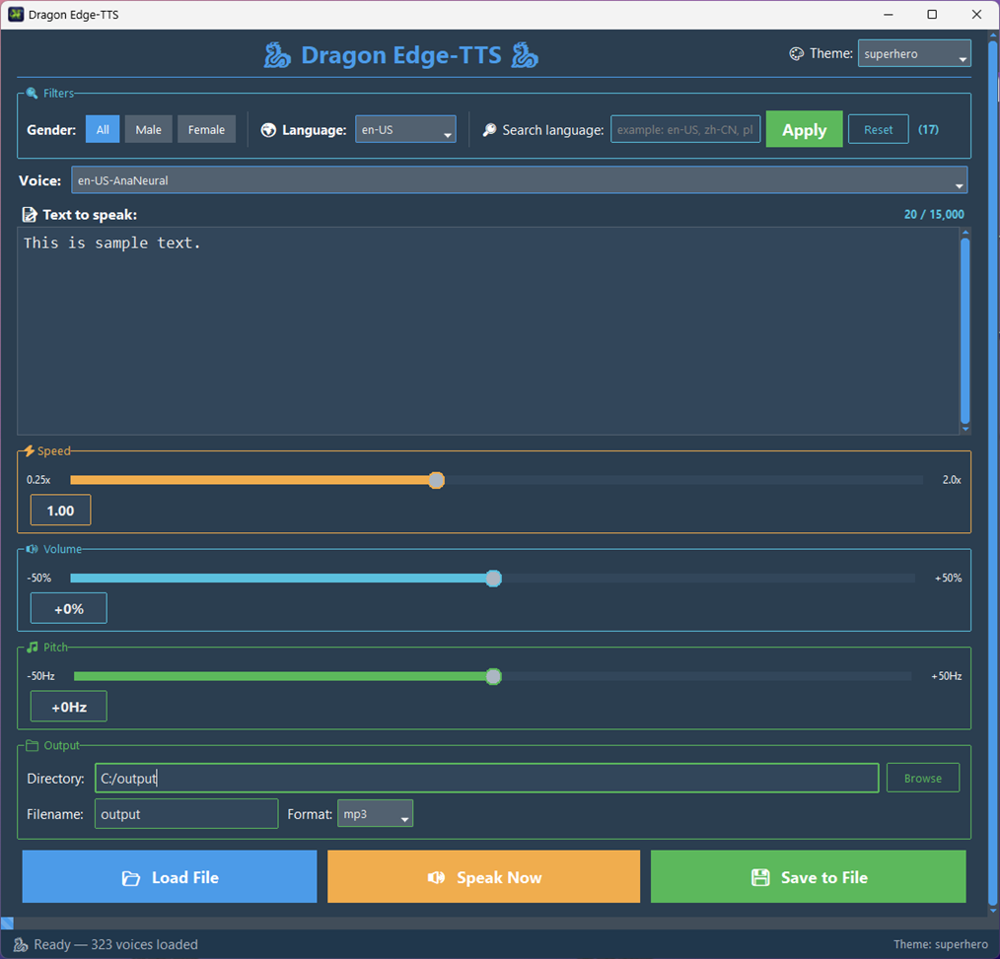

# Dragon Edge-TTS

GUI application that uses the Microsoft Edge Text-to-Speech engine (`edge-tts`).

## Features

- Access to over 400 voices in 50+ languages
- Dynamic voice filtering (by language and gender) with live search field
- 20+ different UI themes
- Direct text input with real-time character counter and length warnings
- File import support for:
  - PDF, DOCX, ODT, EPUB, HTML, TXT
  - CSV, JSON, XML, Markdown, RTF
  - Subtitles (.srt, .ass, .vtt)
- Adjustable speech parameters:
  - Speed: 0.25× – 2.0×
  - Volume: -50% to +50%
  - Pitch: -50Hz to +50Hz
- Two operation modes:
  - Speak Now (immediate playback)
  - Save to File (with custom directory and filename)
- Supported output formats: MP3, WAV, OGG, M4A, FLAC, AAC, WMA, AIFF, OPUS

## Screenshot

## Installation

1. Download the latest `.exe` from the [Releases](https://github.com/yourusername/dragon-edge-tts/releases) page.
2. Run `Dragon-Edge-TTS.exe` (no installation required).
3. The app requires internet connecion (online)
